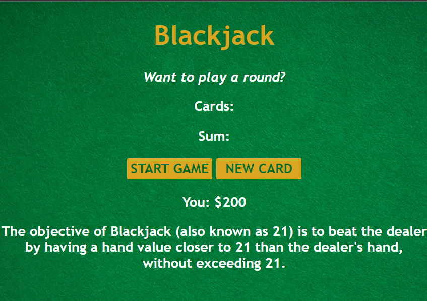

# BlackJack Game <a href="https://blackjack-bydivvsaxena.netlify.app/" target="_blank">Here</a>

This is a simple implementation of the classic BlackJack game using HTML, CSS, and JavaScript. In this game, you can play as the player against the computer dealer. The goal is to get a hand value as close to 21 as possible without exceeding it , minimize your screen size for better user experience.

## How to Play

1. Clone or download the repository to your local machine or play online with deployed link.
2. Open the `index.html` file in your web browser.
3. Click the "Deal" button to start a new game.
4. You and the dealer will be dealt two cards each.
5. You can click the "Hit" button to request another card, or the "Stand" button to keep your current hand.
6. The dealer will then play its hand according to the standard BlackJack rules.
7. If your hand value is closer to 21 than the dealer's, or if the dealer busts (exceeds 21), you win!
8. Enjoy the game and have fun!

## Features

- Interactive gameplay using buttons for Hit and Stand.
- Dynamic updates of player's and dealer's hands and scores.
- Win, lose, and draw scenarios handled with clear messages.
- Stylish design for a user-friendly experience.

## Implementation Details

The game is implemented using HTML, CSS, and JavaScript. The JavaScript code handles the game logic, including dealing cards, calculating hand values, and determining the winner. The game uses a standard deck of 52 playing cards.

## Credits

- CSS styling inspiration: Scrimba
- JavaScript guidance: [MDN Web Docs](https://developer.mozilla.org/en-US/docs/Web/JavaScript) and Scrimba

## Acknowledgments

I would like to thank the open-source community for providing valuable resources and inspiration to create this BlackJack game.

Feel free to fork the repository, make improvements, and share your own version of the game!

Have fun playing BlackJack! 🃏🎉
